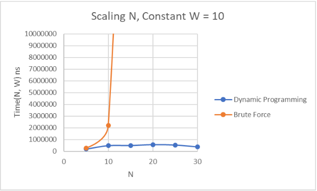
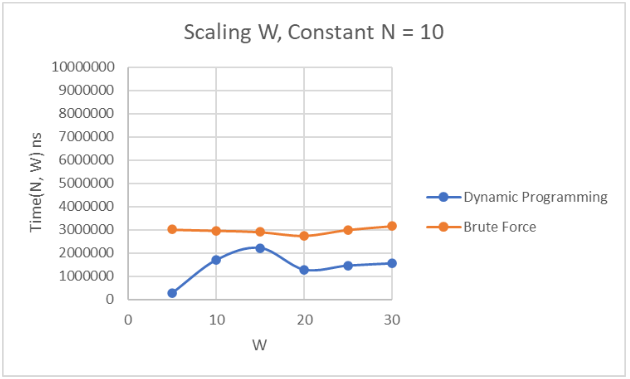
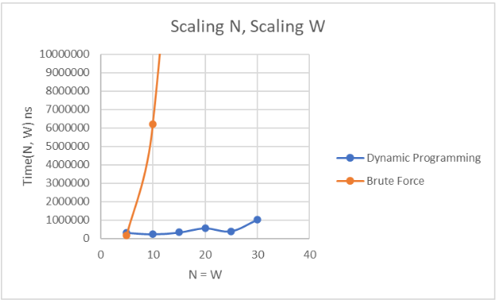

<b>Empirical Analysis of 0-1 Knapsack Solutions: Brute Force v. Dynamic Programming</b>

The first challenge I encountered was implementing the Dynamic Programming solution as a purely recursive function. This is more efficient memory-wise, but I couldn’t easily figure out the backtracking algorithm without the table. So I created a function to fill a table, then backtrace down using the backtracking algorithm discussed in the book.

The more difficult algorithm was the brute force solution. I spent a lot of time researching how to generate all subsets of a given set and settled on a method that uses boolean algebra on the binary representations of numbers. I’m going to be honest, this method only made sense to me briefly. The gist, however, is that for each number i to 2n, we iterate through the item set, computing: 

( i & 2j ) > 0 
& - Bitwise  AND 

…where j is the current index of the item set. If this statement evaluates to true, we include the item[j] in the subset, and by the time we iterate through all n items in the set we’ve created a unique subset. I traced this for maybe 2 hours and was unable to convince myself it works but then it was 1:00 am and I needed to just try it out. By the grace of the Machine_God, it Just WorksTM. Once I could generate all subsets, it was as simple as simply tracking which subset has the highest value while remaining within the weight threshold.  

<b>Writing Test Cases</b> 
	Both algorithms’ time performance scales with different variables (number of items N, weight capacity W), so I wanted to test how both algorithms perform when different variables are altered. I created three tests through which to benchmark each algorithm.The first test case scales N up and leaves W constant.The second test case scales W up while leaving N constant. The third scales both variables proportionally to each other. In this way you can see the effect each variable has on each Algorithm. Another note worth mentioning is that I capped the values at 30 because when N > 32, an overflow will occur in the brute force solution that will cause the code to behave in an undefined way. In addition, at N = 30, the performance of the brute force solution is so bad that it makes the graph difficult to read as it eclipses the curve of the dynamic programming solution. From this, we can determine that the only time one may ever want to consider the brute force solution to this particular problem would be if you are testing variable weight thresholds W under a fixed size N and ALSO N is below 10.  

<b>Experiment Results</b>  

